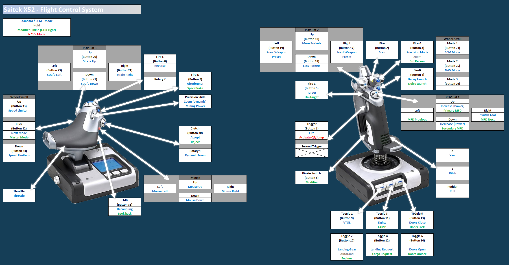
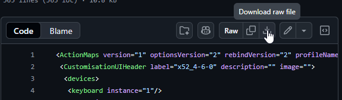
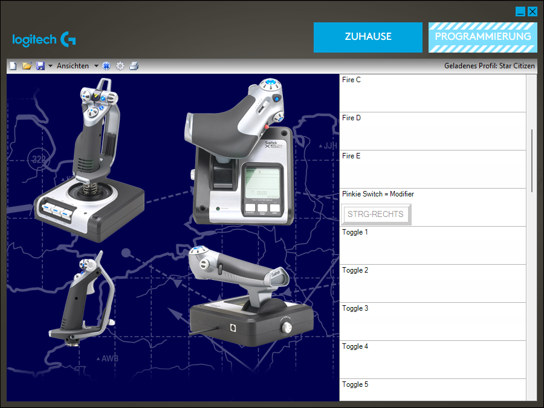
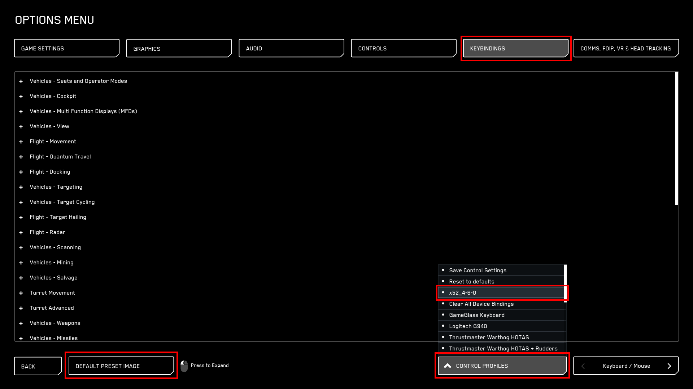
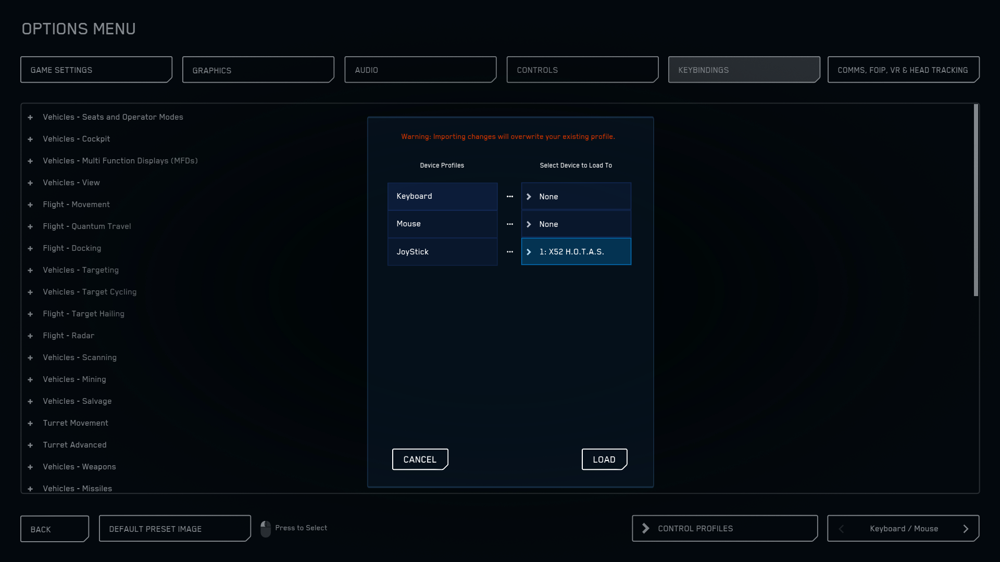
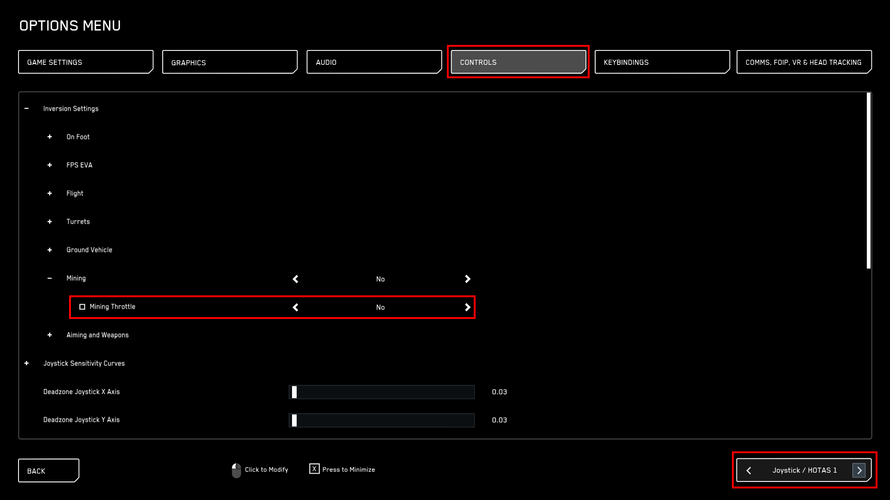

# Logitech Saitek x52 HOTAS Profile for Star Citizen v4.6.0

_German description below / Deutsche Beschreibung unten_

_See images at the end for help_

## EN - Description:
- For this setup I use the pinkie as a modifier to be able to use some buttons for multiple actions. And the modifier itself is the right control button, so you have to add it into the profile-software.
- Also, I did disable the mode selector (normally used as a switch between profiles) to be able to use it for the master mode.

### HowTo Install:
1. Download XML from GitHub: [Xml-file](SC_4-6-0_Salu_x52.xml)
    - Copy the XML into your StarCitizen folder under <ins>"\StarCitizen\LIVE\USER\Client\0\Controls\Mappings"</ins> (or PTU, etc)
2. Download pr0-profile-file from GitHub: [pr0-file](SC_x52.pr0)
    - Copy the pr0-file into your profiles folder of your HOTAS-software under <ins>"C:\Users\Public\Documents\Logitech\X52"</ins>
5. Load the profile into the software
    - Make sure your "X52_Profiler" _(<ins>"C:\Program Files\Logitech\X52\X52_Profiler.exe"</ins>)_ is run on startup so it runs with the start of windows and you dont have start it always manually
7. Get into the game.
8. Open the settings and go to <ins>Keybindings</ins> -> <ins>Advanced Controls Customization</ins>
    - Under <ins>Control Profiles</ins> select the keybinds ```x52_4-6-0```
    - For JoyStick select your ```X52 H.O.T.A.S.```
11. Go to <ins>Controls</ins> and select <ins>Joystick / HOTAS</ins>
    - In the <ins>Inversion Settings</ins> go to <ins>Mining</ins> and set the inversion of <ins>Mining Throttle</ins> to ```No``` _(relevant if you're doing mining with the joystick and dont want to have it inverted)_
13. Enjoy your flight and let me know if you have any issues or any other feedback

<sub>Note: If not installed, you can find the HOTAS software here: https://support.logi.com/hc/en-us/articles/360024847013--Downloads-X52-Space-Flight-H-O-T-A-S</sub>

<br/>

## DE - Beschreibung:
- Für dieses Setup habe ich den "Pinkie" (kleiner Finger) als Modifikator genutzt um die Buttons mehrfach zu belegen. Als Taste des Modifiers habe ich die rechte Steuerungstaste verwendet (da die fast nie genutzt wird), der muss dann im Profil von der HOTAS-Software rein.
- Außerdem habe ich die Funktion vom Mode-Switch ausgeschalten (mit dem man normalerweise zwischen den Profilen in der Software durchwechselt) um den für den Master-Mode nutzen zu können.
### HowTo Installieren:
1. Lade die XML von GitHub herunter: [Xml-Datei](SC_4-6-0_Salu_x52.xml)
    - Kopiere die XML in deinen Star Citizen-Ordner <ins>"StarCitizen\LIVE\USER\Client\0\Controls\Mappings"</ins> (oder PTU, etc)
3. Lade die pr0-Profil-Datei von GitHub herunter: [pr0-Datei](SC_x52.pr0)
    - Kopiere die pr0-Datei in deinen Profile-Ordner der HOTAS-Software unter <ins>"C:\Users\Public\Documents\Logitech\X52"</ins>
5. Lade das Profil in der Software
    - Stelle sicher dass der "X52_Profiler" _(<ins>"C:\Program Files\Logitech\X52\X52_Profiler.exe"</ins>)_ im Autostart aktiv ist, damit es immer beim Start von Windows läuft und nicht jedes mal manuell gestartet werden muss.
7. Starte das Spiel
8. Öffne die Einstellungen und gehe zu <ins>Tastenbelegung</ins> -> <ins>Erweiterte Steuerung anpassen</ins>
    - Unter <ins>Steuerungsprofile</ins> wähle die Tastenbelegung ```x52_4-6-0``` aus
    - Wähle bei Joystick deinen ```X52 H.O.T.A.S.``` aus
11. Gehe zu <ins>Steuerung</ins> und wähle <ins>Joystick / HOTAS</ins> aus
    - In den <ins>Invertierungseinstellungen</ins> unter <ins>Bergbau</ins> die Inverteriung von <ins>Abbau-Leistung</ins> auf ```Nein``` stellen _(relevant wenn du Bergbau mit dem Joystick betreibst und nicht den Schieberegler invertiert haben willst)_
13. Viel Spaß beim Fliegen und lass mich wissen wenn du irgendwelche Probleme oder anderes Feedback hast

<sub>Hinweis: Falls nicht installiert, hier ist die HOTAS-Software zu finden: https://support.logi.com/hc/de/articles/360024847013--Downloads-X52-Professional-Space-Flight-H-O-T-A-S</sub>

<br/>

## Keybind Map


## Images for the setup
Download files:
> 

Logitech software:
> 

Select mapping
> 

Select H.O.T.A.S.
> 

Set inversion
> 
